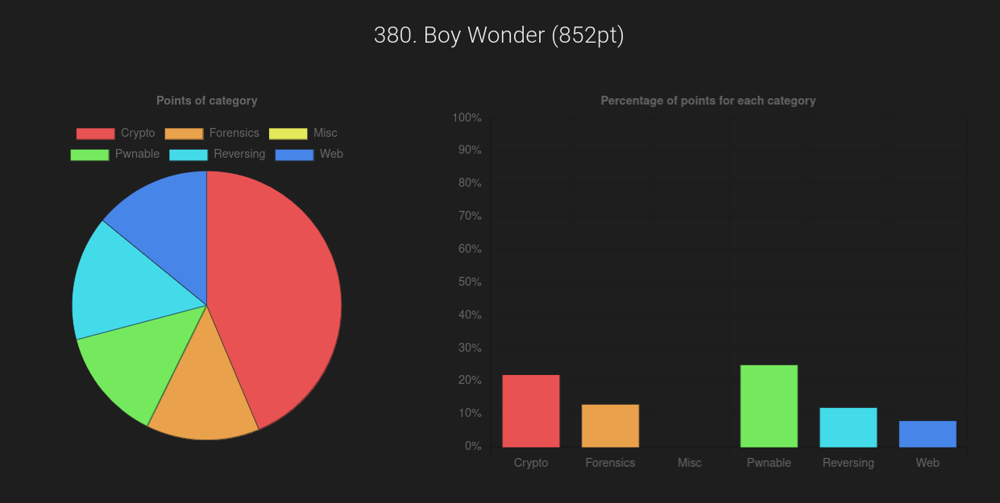
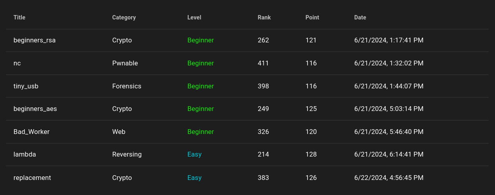

# WaniCTF 2024 Writeup

[WaniCTF 2024](https://wanictf.org/) was a 48 hour competition that ran from 6/21/2024 to 6/23/2024. Below are my writeups for the challenges that I was able to complete. You can also see my results
in the competition and the software I used below my writeups.

## Solved Challenges

  
Crypto

  * [beginners_aes](https://github.com/rstacks/WaniCTF2024-writeup/tree/master/Crypto/beginners_aes)
  * [beginners_rsa](https://github.com/rstacks/WaniCTF2024-writeup/tree/master/Crypto/beginners_rsa)
  * [replacement](https://github.com/rstacks/WaniCTF2024-writeup/tree/master/Crypto/replacement)
  

  
Forensics

  * [tiny_usb](https://github.com/rstacks/WaniCTF2024-writeup/tree/master/Forensics/tiny_usb)
  

  
Pwnable

  * [nc](https://github.com/rstacks/WaniCTF2024-writeup/tree/master/Pwnable/nc)
  

  
Reversing

  * [lambda](https://github.com/rstacks/WaniCTF2024-writeup/tree/master/Reversing/lambda)
  

  
Web

  * [Bad_Worker](https://github.com/rstacks/WaniCTF2024-writeup/tree/master/Web/Bad_Worker)
  

## Results

I was the sole member of team Boy Wonder. I scored **852 points** in total and finished **380th out of 1022** teams (that solved at least one challenge).

## Software and Tools

The challenges I completed during this competition did not require many special tools. I was able to solve all of the challenges I attempted using my laptop with [Ubuntu 22.04](https://ubuntu.com/desktop) and [Kali Linux](https://www.kali.org/) through [VirtualBox](https://www.virtualbox.org/).
